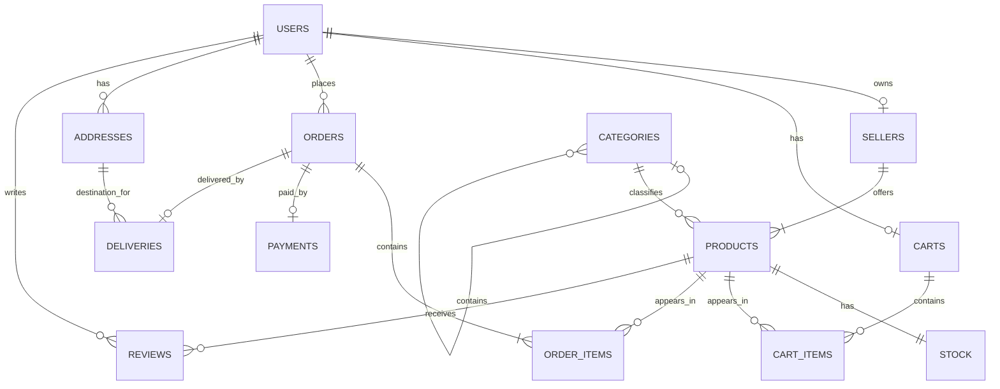

```mermaid
erDiagram
    USERS ||--o| SELLERS : owns
    USERS ||--o| CARTS : has
    USERS ||--o{ ORDERS : places
    USERS ||--o{ ADDRESSES : has
    USERS ||--o{ REVIEWS : writes

    SELLERS ||--|{ PRODUCTS : offers

    CATEGORIES o|--o{ CATEGORIES : contains
    CATEGORIES ||--o{ PRODUCTS : classifies

    PRODUCTS ||--|| STOCK : has

    CARTS ||--o{ CART_ITEMS : contains
    PRODUCTS ||--o{ CART_ITEMS : appears_in

    ORDERS ||--|{ ORDER_ITEMS : contains
    PRODUCTS ||--o{ ORDER_ITEMS : appears_in

    ORDERS ||--o| PAYMENTS : paid_by
    ORDERS ||--o| DELIVERIES : delivered_by
    ADDRESSES ||--o{ DELIVERIES : destination_for

    PRODUCTS ||--o{ REVIEWS : receives
```